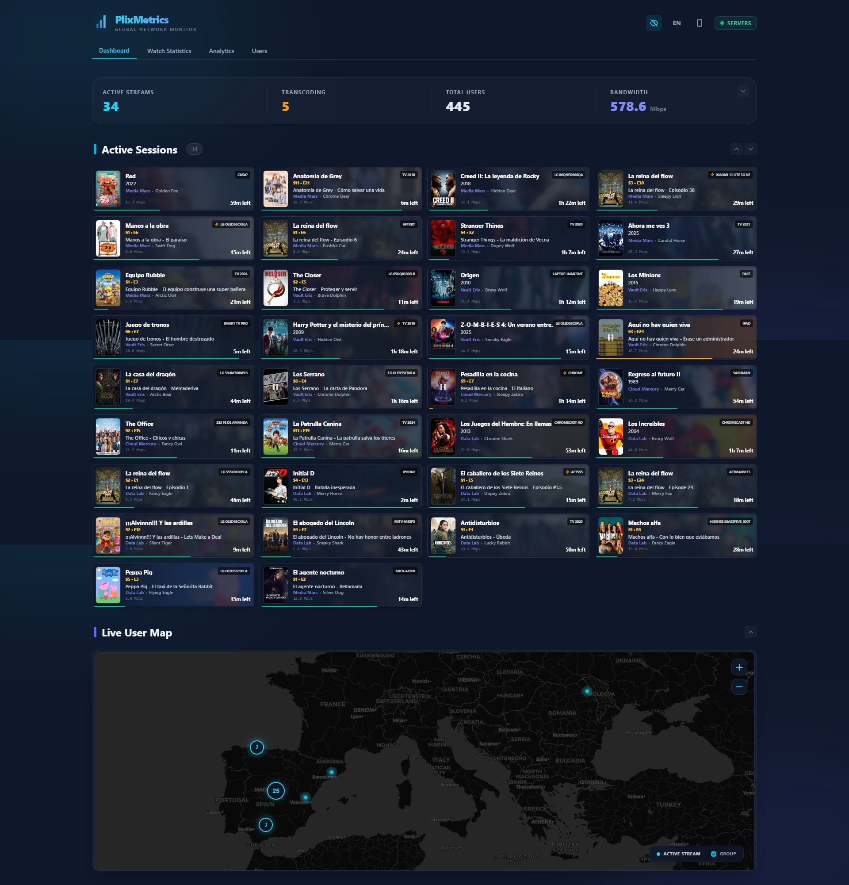
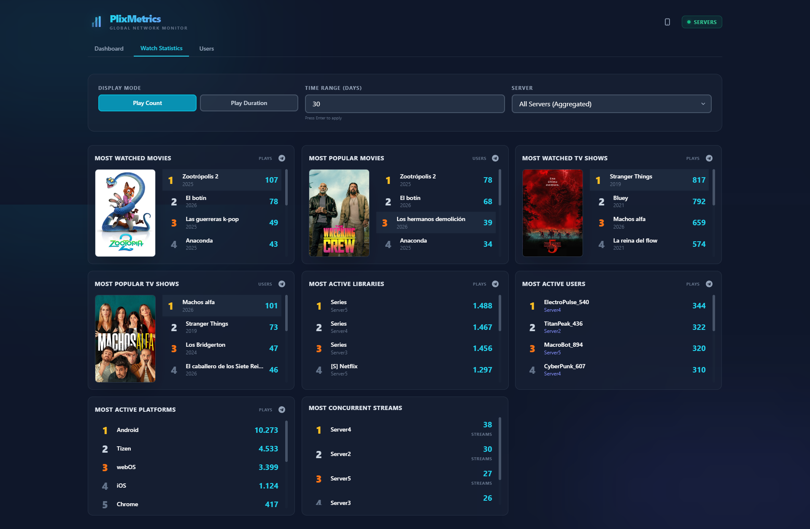
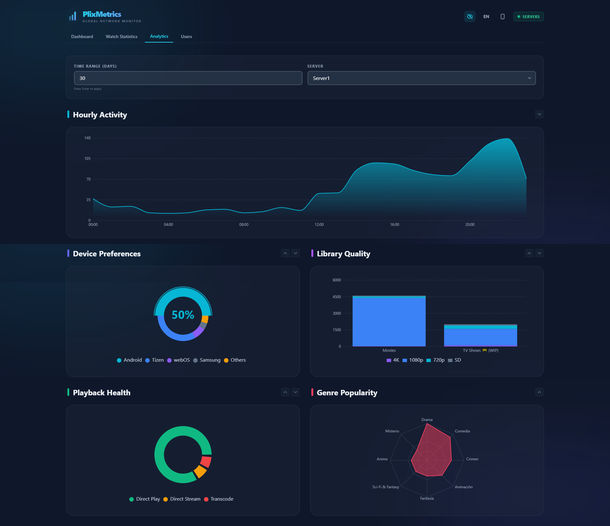
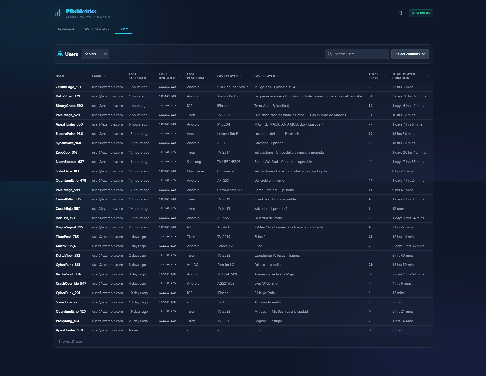
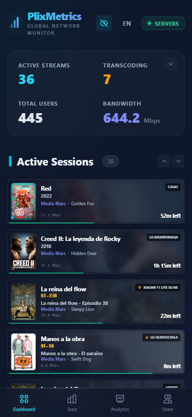
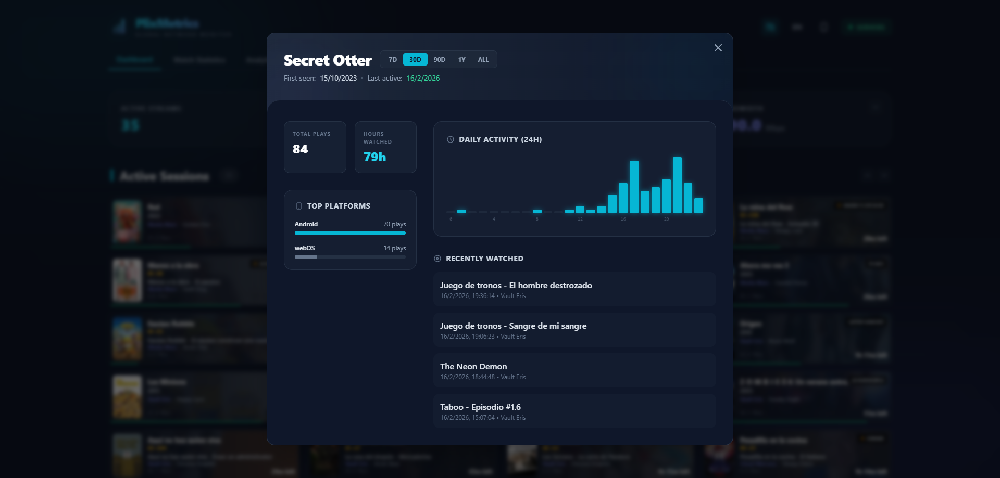

# PlixMetrics

A self-hosted, real-time Plex network monitoring dashboard. Track multiple Tautulli instances, visualize streaming activity on a world map, and analyze viewing statistics.



## 📸 Screenshots

| 📊 Statistics | � Analytics |
| :---: | :---: |
|  |  |

| 👥 Users | 📱 Mobile View |
| :---: | :---: |
|  |  |

| ✨ Session Detail |
| :---: |
|  |

## Features

- 🗺️ **Live World Map** - See where your streams are happening in real-time
- 📊 **Real-time Statistics** - Bandwidth, stream count, transcoding status
- 📈 **Watch Statistics** - Most watched movies, shows, users, platforms
- 🔒 **Secure & Self-Hosted** - Password protection, JWT authentication, and local data storage
- 🐳 **Docker Ready** - Easy deployment with Docker Compose
- 🖥️ **Windows Native** - Easy to use standalone installer (.exe) with auto-updates
- 🚀 **Lightweight** - Single container, SQLite database
- 📱 **Mobile Ready** - Responsive design with PWA support
- 🌍 **Multi-language Support** - Available in English, Spanish, French, Portuguese, German, Russian, and Chinese
- 🧘 **Zen Mode** - Immersive, full-screen map-only view with floating metrics

---

## Installation & Deployment

### minimal Requirements
- **Node.js**: v20 or higher (for manual install)
- **Docker**: Engine 20.10+ (for Docker install)
- **Memory**: ~256MB RAM (very lightweight)

---

### 🐳 Method 1: Docker (Recommended)

Run the container directly from the GitHub Container Registry. No need to clone the repo or build manually!

**1. Create a `docker-compose.yml` file:**

```yaml
version: '3.8'
services:
  plixmetrics:
    image: ghcr.io/plix-labs/plixmetrics:latest
    container_name: plixmetrics
    restart: unless-stopped
    ports:
      - "8282:8282"
    volumes:
      - plixmetrics-data:/data
    environment:
      - PORT=8282
      # Optional: set user/group ID if needed
      # - PUID=1000
      # - PGID=1000

volumes:
  plixmetrics-data:
```

**2. Start the container:**
```bash
docker-compose up -d
```
Access the dashboard at `http://YOUR_SERVER_IP:8282`.

**Updating (Docker):**
```bash
docker-compose pull && docker-compose up -d
```


---

### 📦 Method 2: Windows Installer (Easiest for Windows)

Download the latest standalone executable (`.exe`) from the [Releases page](https://github.com/plix-labs/PlixMetrics/releases).

**Installation:**
1.  Download `PlixMetrics-Setup-vX.X.X.exe`.
2.  Run the installer and follow the prompts.
3.  PlixMetrics will launch automatically in a console window, and your browser will open to the dashboard.

**Features:**
*   **Portable:** Includes its own Node.js runtime (no need to install Node separately).
*   **Auto-Updates:** Checks for new versions on startup and updates itself automatically.
*   **Persistent Data:** All data is stored in `%APPDATA%\PlixMetrics`.

To uninstall, use Windows "dApps & features" or run `unins000.exe` in the installation folder.

---

### 🛠️ Method 3: Manual Installation (Linux/Node.js)

If you prefer running directly on the metal or in an LXC container.

**1. Clone the repository:**
```bash
git clone https://github.com/plix-labs/PlixMetrics.git
cd PlixMetrics
```

**2. Install Dependencies:**
```bash
# Install root dependencies
npm install

# Install server dependencies
cd server && npm install && cd ..
```

**3. Build the Application:**
This compiles both the React frontend and the Node.js backend.
```bash
npm run build:all
```

**4. Start the Application:**
```bash
npm start
```

**5. (Optional) Run in background with PM2:**
To keep the app running after you close the terminal, use [PM2](https://pm2.keymetrics.io/):

```bash
# Install PM2 globally
sudo npm install -g pm2

# Start PlixMetrics
pm2 start npm --name "plixmetrics" -- start

# Save process list to resurrect on reboot
pm2 save
pm2 startup
```

---

## Configuration & Usage

### 1. Initial Setup
On your first visit to `http://YOUR_SERVER_IP:8282`, you will be prompted to create an Admin Password. This password secures your dashboard from unauthorized remote access.

*Note: Access from `localhost` is automatically authorized.*

### 2. Connect Tautulli
PlixMetrics relies on Tautulli for data. You must have Tautulli installed and running.

1. Click the **"Servers"** button in the dashboard or **"Settings"**.
2. Click **"Add Server"**.
3. Fill in the details:
   - **Name**: A friendly name (e.g., "My Plex Server").
   - **URL**: The full URL to Tautulli (e.g., `http://192.168.1.50:8181`).
   - **API Key**: Find this in Tautulli under **Settings -> Web Interface -> API Key**.

### 3. Mobile App (PWA) Setup 📱
PlixMetrics is a Progressive Web App. You can install it on your phone for a native-like experience.

1. On your PC dashboard, click the **Phone Icon** (📱) in the header.
2. Scan the **QR Code** with your mobile phone.
3. On your phone, tap **"Add to Home Screen"** in your browser menu.
4. Launch it from your home screen for a full-screen experience.

### 4. 🧘 Zen Mode (Minimal View)
A distraction-free, immersive view designed for dedicated monitoring screens or a clean dashboard experience. It features a full-screen map with floating real-time metrics and no UI clutter.

#### Desktop Access:
- **Enter**: Press **`Z`** or **`F`** keys while on the dashboard.
- **Exit**: Press **`ESC`** key or click the floating **X** close button (which appears automatically when moving the mouse).
- **Interactive**: A minimalist "Group" checkbox is available in the bottom-left to toggle marker clustering.

#### Mobile Access:
- **Enter**: Rotate your device to **Landscape** orientation. A "Minimal View" (monitor icon) will appear in the top header; tap it to activate the mode.
- **Exit**: Simply rotate your device back to **Portrait** orientation.

---

### 🌐 Remote Access (Outside Home Network)

There are two ways to access PlixMetrics from anywhere in the world:

#### Option A: Direct IP + Port (Easiest)
You can access PlixMetrics via `http://YOUR_IP:8282`.

1. **Find your Public IP:** Search "what is my ip" on Google.
2. **Port Forwarding:** Log into your router's admin page and forward port **8282** (TCP) to the internal IP of your server.
3. **Access:** Open `http://YOUR_PUBLIC_IP:8282` in your browser. You will be asked to log in.

#### Option B: Reverse Proxy (Advanced & Secure)
If you have a domain (e.g., `stats.yourdomain.com`) and want to use HTTPS.

**Nginx Example:**
```nginx
server {
    listen 80;
    server_name stats.yourdomain.com;

    location / {
        proxy_pass http://localhost:8282;
        proxy_http_version 1.1;
        proxy_set_header Upgrade $http_upgrade;
        proxy_set_header Connection 'upgrade';
        proxy_set_header Host $host;
        proxy_cache_bypass $http_upgrade;
    }
}
```

### 🔌 Port Configuration

The default port is **8282**.

**How to change it (Docker):**
Edit `docker-compose.yml`:
```yaml
ports:
  - "3000:8282"  # Format is HOST:CONTAINER. Change the left side to your desired port.
```

**How to change it (Manual):**
```bash
# Linux/Mac
PORT=8282 npm start

# Windows (Powershell)
$env:PORT=8282; npm start
```

### Environment Variables

| Variable | Default | Description |
|----------|---------|-------------|
| `PORT` | `8282` | Server port |
| `DATA_DIR` | `./data` | Directory for SQLite database |
| `JWT_SECRET` | (random) | Secret key for authentication tokens |
| `NODE_ENV` | `production` | Environment mode |

## Architecture

```
PlixMetrics/
├── src/                    # React frontend
├── server/                 # Express.js backend
│   └── src/
│       ├── routes/         # API endpoints
│       ├── services/       # Business logic (Auth, System, Tautulli)
│       └── db/             # SQLite schema
├── Dockerfile              # Multi-stage build
└── docker-compose.yml      # Easy deployment
```

### Tech Stack

- **Frontend**: React, TypeScript, Tailwind CSS, React Query
- **Backend**: Node.js, Express.js, TypeScript
- **Database**: SQLite (better-sqlite3)
- **Containerization**: Docker

## API Endpoints

| Endpoint | Method | Description |
|----------|--------|-------------|
| `/api/auth/login` | POST | Login and get token |
| `/api/auth/setup` | POST | Initial admin setup |
| `/api/servers` | GET | List all servers |
| `/api/servers` | POST | Add a server |
| `/api/network` | GET | Get network status |
| `/api/stats` | GET | Get watch statistics |
| `/api/system/version` | GET | Check for updates |
| `/api/health` | GET | Health check |


## License

GNU GPLv3 License - see [LICENSE](LICENSE) for details.

---

Made with ❤️ for the Plex community